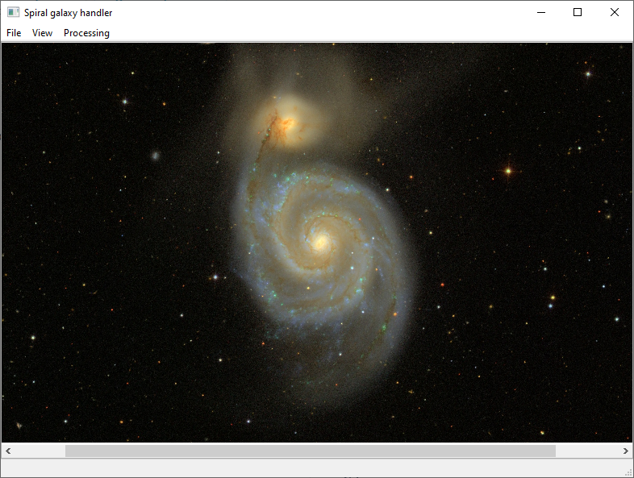
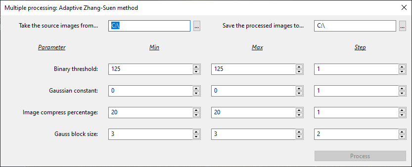
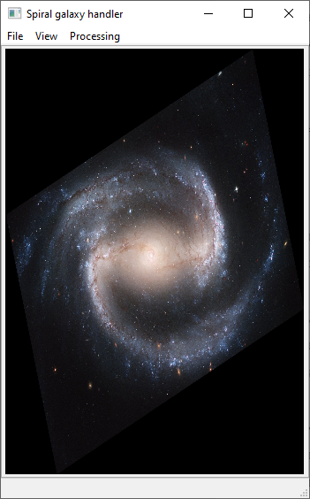
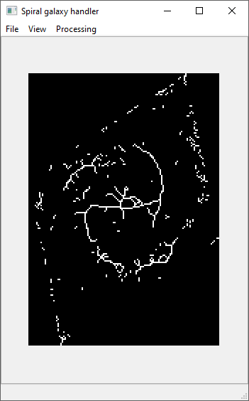

# Description
A program for the selection of strings in the structure of spiral galaxies
______

## Requirements
1. OpenCV
2. wxWidgets
3. Visual Studio
4. Lazarus (for launcher)
______

## Features
- Software localisation (EN, RU)
- User manual (EN, RU)
- Converting the image to a "flat view" (rotation and stretching)
- Skeletonization by "Adaptive Zhang-Suen method" (adaptive threshold + Zhang-Suen)
- Image multiple processing (multi-threaded)
______

## App screenshots

______

## Processing result 

### Parameters

- Angle = 20 deg.
- Width = 1352 (base 1893)
- Height = 1924 (base 1080)
- Binary threshold = 250
- Gaussian constant = -5
- Image compression = 10 percents
- Gaussian block size = 401

